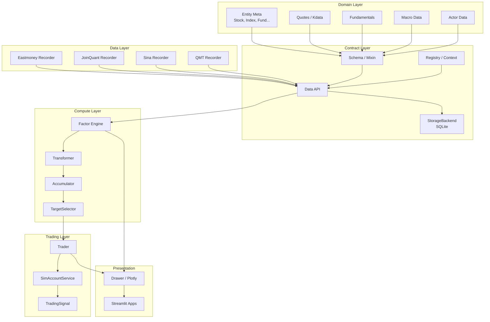
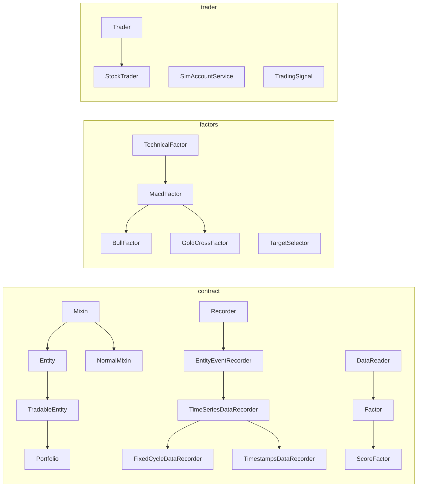
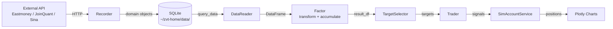

# ZVT Documentation

Last updated: 2026-04-06
Source: [src/zvt/](../src/zvt/)

## Overview

ZVT (Zero to Venture Trading) is a modular, domain-driven quant trading framework written in Python. It provides an end-to-end pipeline for Chinese (and select international) markets covering entity registration, market data recording, factor computation, stock selection, simulated trading, and visualization.

The framework is built around a clear separation of concerns:

- **Domain Model** -- entity definitions for stocks, indices, ETFs, futures, crypto, and more
- **Contract Layer** -- schema system, data API, recorder base classes, factor base classes
- **Recorders** -- pluggable data providers (Eastmoney, JoinQuant, Sina, QMT, etc.)
- **Factors** -- technical and fundamental factor computation with transform/accumulate pipeline
- **Trader** -- event-driven backtesting and simulated trading engine
- **UI** -- Plotly-based charting and Streamlit applications

## Key Features

| Area | Capabilities |
|------|-------------|
| **Data Recording** | Multi-provider architecture (Eastmoney, JoinQuant, Sina, QMT); incremental fetching; time-series and event-based recorders |
| **Entity Coverage** | A-shares (SSE, SZSE, BSE), HK stocks, US stocks, futures, options, crypto, currencies, ETFs, indices, blocks |
| **Factor Engine** | Transformer (stateless) and Accumulator (stateful) pipeline; MACD, MA, Zen (Chan), shape factors; persistence to SQLite |
| **Stock Selection** | `TargetSelector` combining filter and score results; AND/OR selection modes |
| **Trading** | `Trader` with `SimAccountService`; position control, profit/loss thresholds, multi-level signal generation |
| **Storage** | SQLite per (provider, db_name) pair; configurable via `StorageBackend` and `RouteRegistry`; WAL mode for hot tables |
| **Visualization** | Plotly candlestick, line, area, scatter, bar charts; annotation overlays for buy/sell signals |

## Architecture Overview



## Component Overview



## Directory Structure

```
src/zvt/
  __init__.py          # Environment init, plugin loading
  consts.py            # Home paths, sample codes
  config.json          # Default configuration
  contract/            # Core abstractions (schema, API, recorder, factor, reader, drawer)
  domain/              # Entity definitions grouped by type
    meta/              # Stock, Index, Fund, Future, Currency, etc.
    quotes/            # OHLCV kdata per entity type and interval
    fundamental/       # Balance sheet, income, cash flow
    macro/             # Macroeconomic data
    actor/             # Institutional holders, top-ten holders
    emotion/           # Market sentiment data
    misc/              # Miscellaneous domain schemas
  recorders/           # Data providers: eastmoney, em, joinquant, sina, qmt, exchange, jqka, wb
  factors/             # Factor implementations: MACD, MA, Zen, shape, fundamental, top_stocks
  trader/              # Trader engine, sim account, order management
  tag/                 # Tagging system (AI suggestions, tag stats)
  informer/            # Notification / alerting
  ml/                  # Machine learning utilities
  ui/                  # Streamlit apps and Plotly components
  rest/                # REST API endpoints
  sched/               # Scheduling utilities
  utils/               # Time, pandas, string, file, zip utilities
```

## Related Documentation

| Document | Description |
|----------|-------------|
| [Architecture](architecture.md) | Domain model, data layer, factor engine, trader engine, UI layer |
| [Workflow](workflow.md) | Data recording, factor computation, stock selection, and trading flows |
| [State Management](state-management.md) | Entity state, data schemas, factor state, trader state |
| [Development](development.md) | Design patterns, coding standards, custom factor/trader examples |
| [Migration Guide](MIGRATION_GUIDE.md) | Storage migration notes |
| [Storage Config](storage_config.md) | Storage backend configuration |

## Supported Entity Types

| Type | Class | Exchanges | Description |
|------|-------|-----------|-------------|
| `stock` | `Stock` | SSE (sh), SZSE (sz), BSE (bj) | A-share stocks |
| `index` | `Index` | SSE, SZSE | Market indices (CSI 300, SSE 50, etc.) |
| `block` | `Block` | cn | Sector/concept/region blocks |
| `fund` | `Fund` | SSE, SZSE | Mutual funds and ETFs |
| `future` | `Future` | SHFE, DCE, CZCE, CFFEX, INE | Commodity and financial futures |
| `cbond` | `Cbond` | SSE, SZSE | Convertible bonds |
| `stockhk` | `Stockhk` | HKEX (hk) | Hong Kong stocks |
| `stockus` | `Stockus` | NASDAQ, NYSE | US stocks |
| `coin` | -- | Binance, Huobi | Cryptocurrencies |
| `currency` | `Currency` | forex | Currency exchange rates |
| `option` | -- | -- | Options (China) |

## Data Interval Levels

ZVT supports multiple granularities for kdata via `IntervalLevel`:

| Level | Value | Description |
|-------|-------|-------------|
| `LEVEL_TICK` | `tick` | Tick-level data |
| `LEVEL_1MIN` | `1m` | 1-minute bars |
| `LEVEL_5MIN` | `5m` | 5-minute bars |
| `LEVEL_15MIN` | `15m` | 15-minute bars |
| `LEVEL_30MIN` | `30m` | 30-minute bars |
| `LEVEL_1HOUR` | `1h` | 1-hour bars |
| `LEVEL_4HOUR` | `4h` | 4-hour bars |
| `LEVEL_1DAY` | `1d` | Daily bars |
| `LEVEL_1WEEK` | `1wk` | Weekly bars |
| `LEVEL_1MON` | `1mon` | Monthly bars |

Adjust types: `bfq` (unadjusted), `qfq` (forward-adjusted), `hfq` (backward-adjusted).

## Data Flow Diagram



## Quick Start

This example initializes the ZVT environment, downloads daily kdata for Ping An Bank (000001) from Eastmoney (no API key needed), computes the MACD Bull factor, and prints the resulting signal dates.

```python
import os
# Set a custom home directory (optional; defaults to ~/zvt-home)
os.environ["ZVT_HOME"] = os.path.expanduser("~/zvt-home")

from zvt import init_env, zvt_env
init_env(zvt_home=zvt_env["zvt_home"])

from zvt.domain import Stock, Stock1dKdata

# 1. Record entity list and daily kdata from Eastmoney (free, no key)
Stock.record_data(provider="em")
Stock1dKdata.record_data(provider="em", code="000001")

# 2. Query the downloaded daily bars
df = Stock1dKdata.query_data(
    code="000001",
    start_timestamp="2024-01-01",
    end_timestamp="2024-12-31",
    provider="em",
)
print(f"Loaded {len(df)} daily bars for 000001")
print(df[["timestamp", "open", "close", "volume"]].head())

# 3. Compute MACD Bull factor (buy when MACD crosses above signal)
from zvt.factors.macd import BullFactor

factor = BullFactor(
    codes=["000001"],
    start_timestamp="2024-01-01",
    end_timestamp="2024-12-31",
    provider="em",
)

# 4. Inspect buy signals
buy_signals = factor.result_df[factor.result_df["filter_result"] == True]
print(f"\nBull signal dates: {len(buy_signals)}")
print(buy_signals.head(10))

# 5. Visualise (opens a Plotly chart in the browser)
# factor.draw(show=True)
```

### Provider-Specific Setup

| Provider | Auth Required | Setup |
|----------|--------------|-------|
| **Eastmoney (em)** | No | Works out of the box. Set `em_header` in `config.json` only if you hit rate limits (copy your browser `User-Agent` header). |
| **JoinQuant (joinquant)** | Yes | Register at [joinquant.com](https://www.joinquant.com/), then set `jq_username` and `jq_password` in `~/zvt-home/config.json` or pass them to `init_env(jq_username="...", jq_password="...")`. |
| **Sina (sina)** | No | Works out of the box for real-time quotes. |
| **QMT (qmt)** | Yes | Windows only. Install the QMT client, set `qmt_mini_data_path` and `qmt_account_id` in `config.json`. |
| **Exchange (exchange)** | No | Fetches from SSE/SZSE official disclosure sites. |

## Source Links

- Entry point: [src/zvt/__init__.py](../src/zvt/__init__.py)
- Schema base: [src/zvt/contract/schema.py](../src/zvt/contract/schema.py)
- Factor base: [src/zvt/contract/factor.py](../src/zvt/contract/factor.py)
- Recorder base: [src/zvt/contract/recorder.py](../src/zvt/contract/recorder.py)
- Trader: [src/zvt/trader/trader.py](../src/zvt/trader/trader.py)
- Data API: [src/zvt/contract/api.py](../src/zvt/contract/api.py)
- Registry: [src/zvt/contract/context.py](../src/zvt/contract/context.py)
- Stock entity: [src/zvt/domain/meta/stock_meta.py](../src/zvt/domain/meta/stock_meta.py)
- MACD factor: [src/zvt/factors/macd/macd_factor.py](../src/zvt/factors/macd/macd_factor.py)
- Target selector: [src/zvt/factors/target_selector.py](../src/zvt/factors/target_selector.py)
