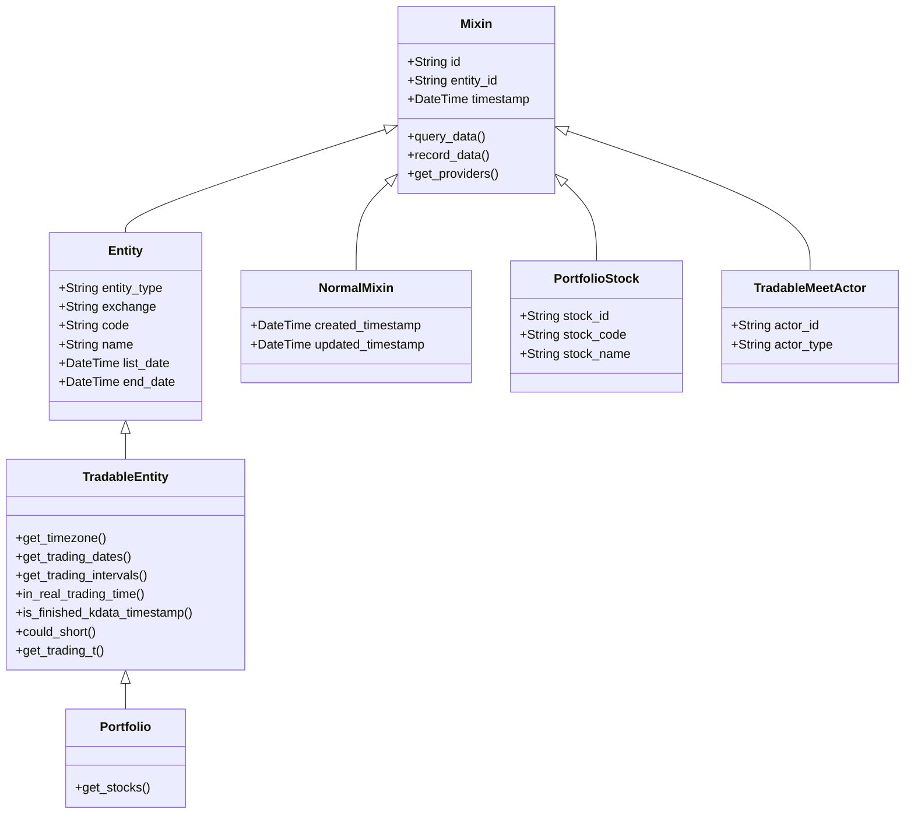
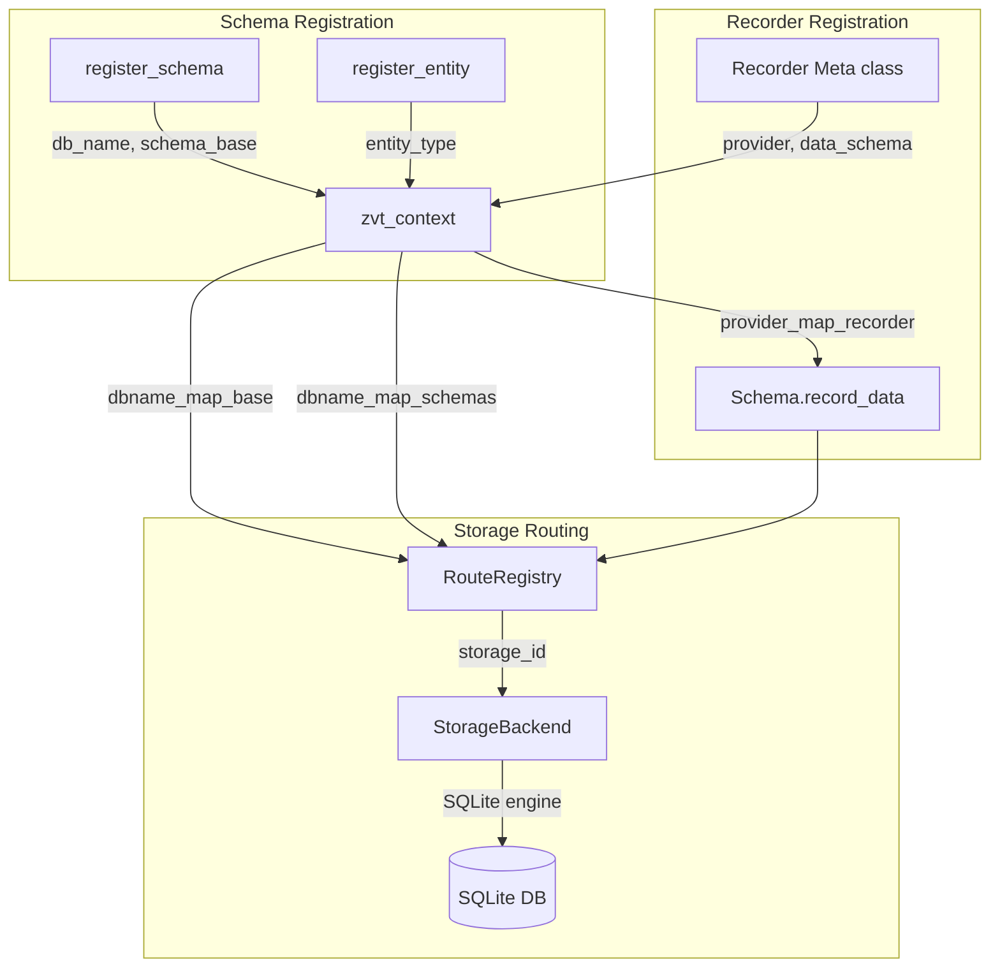
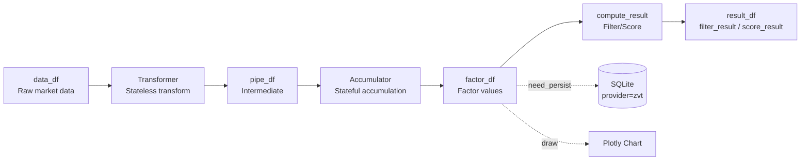
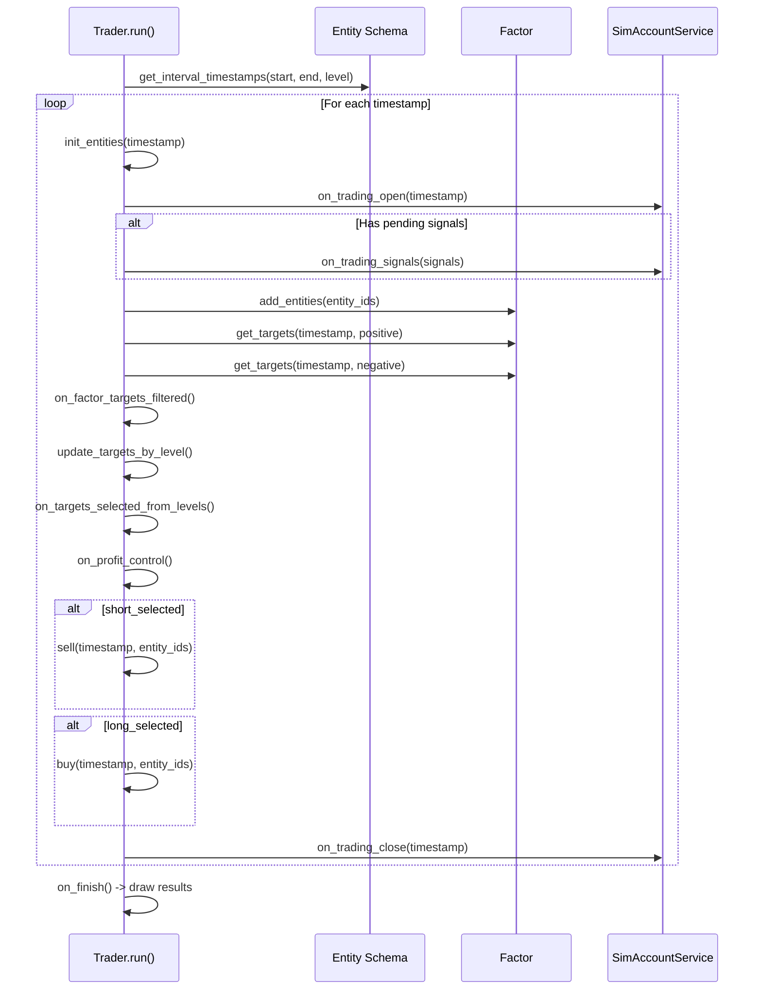

# ZVT Architecture

Last updated: 2026-04-06
Source: [src/zvt/](../src/zvt/)

## Design Philosophy

ZVT follows **domain-driven design** (DDD) principles. Every market entity (stock, index, fund, future) is a first-class domain object with its own schema, metadata, and data pipelines. The framework separates _what data exists_ (domain schemas) from _how data is fetched_ (recorders) and _how data is computed_ (factors), allowing each concern to evolve independently.

Key design tenets:

1. **Schema-first** -- all data is defined via SQLAlchemy declarative models inheriting from `Mixin`
2. **Provider-agnostic** -- the same schema can be filled by multiple data providers
3. **Stateful computation** -- factors maintain state across incremental runs via `EntityStateService`
4. **Convention over configuration** -- table naming (`{entity}_{level}_{adjust}_{event}`), entity ID format (`{entity_type}_{exchange}_{code}`)

## Trading Paradigm & Key Features

| Feature | Support | Details |
|---------|---------|---------|
| Backtesting Approach | Event-driven | Iterates over interval timestamps via `Trader.run()`, simulating trading day by day |
| Live Trading | No | Backtesting-only via `SimAccountService`; no live broker integration |
| Paper Trading | No | Simulated account only within backtesting context |
| Multi-Asset | Yes | Stocks (A-share, HK, US), indices, funds, futures, convertible bonds, currencies, crypto |
| Data Feeds | Multiple providers | Eastmoney, JoinQuant, Sina, exchange direct, QMT broker, 10jqka |
| ML Integration | No | Factor-based signal generation; no built-in ML pipeline |
| Risk Management | Built-in | Stop-gain/stop-loss thresholds (default +300%/-30%), position sizing controls |
| Optimization | No | No hyperparameter optimization; manual factor tuning |
| Execution | Simulated | `SimAccountService` with slippage, commission, T+1 settlement for A-shares |

## Domain Model

The domain model is rooted in `Mixin` (the universal base) and branches into entity types and data types.



Concrete entities are registered via the `@register_entity` decorator in `src/zvt/contract/register.py`:

| Entity Type | Class | File |
|-------------|-------|------|
| `stock` | `Stock` | `src/zvt/domain/meta/stock_meta.py` |
| `index` | `Index` | `src/zvt/domain/meta/index_meta.py` |
| `fund` | `Fund` | `src/zvt/domain/meta/fund_meta.py` |
| `future` | `Future` | `src/zvt/domain/meta/future_meta.py` |
| `cbond` | `Cbond` | `src/zvt/domain/meta/cbond_meta.py` |
| `stockhk` | `Stockhk` | `src/zvt/domain/meta/stockhk_meta.py` |
| `stockus` | `Stockus` | `src/zvt/domain/meta/stockus_meta.py` |
| `coin` | -- | via `TradableType.coin` |
| `currency` | `Currency` | `src/zvt/domain/meta/currency_meta.py` |

## Data Layer

### Storage Architecture

ZVT uses **SQLite** databases organized by `(provider, db_name)` pairs. Each schema declares a `db_name` via `register_schema()`, and each recorder declares a `provider`. The combination yields a unique storage path:

```
~/zvt-home/data/{provider}/{provider}_{db_name}.db
```



The `zvt_context` (`Registry` in `src/zvt/contract/context.py`) is the global singleton holding:

- `providers` -- list of all registered provider names
- `tradable_entity_types` / `tradable_entity_schemas` -- registered entity types
- `dbname_map_base` -- db_name to SQLAlchemy declarative base
- `dbname_map_schemas` -- db_name to list of schema classes
- `provider_map_dbnames` -- provider to list of db_names it serves
- `factor_cls_registry` -- named factor classes for dynamic lookup

### Data API

The core data API lives in `src/zvt/contract/api.py` and provides:

- `get_data()` -- universal query function returning DataFrames, domain objects, or dicts
- `get_entities()` -- query entity lists with filtering by exchange, codes, entity_ids
- `get_db_engine()` / `get_db_session()` -- lazy engine/session creation with automatic table migration
- `df_to_db()` -- persist a DataFrame to the corresponding schema table
- `del_data()` -- delete records with optional filters

## Factor Engine

The factor engine is the computational core. It follows a three-stage pipeline:

```
data_df --> [Transformer] --> pipe_df --> [Accumulator] --> factor_df --> [compute_result] --> result_df
```



### Key Classes

| Class | Location | Role |
|-------|----------|------|
| `Factor` | `src/zvt/contract/factor.py` | Base class: loads data, runs transform/accumulate, persists results |
| `Transformer` | `src/zvt/contract/factor.py` | Stateless column-level transforms (e.g., MACD calculation) |
| `Accumulator` | `src/zvt/contract/factor.py` | Stateful window-based accumulation with per-entity state |
| `Scorer` | `src/zvt/contract/factor.py` | Normalizes factor values to scores |
| `ScoreFactor` | `src/zvt/contract/factor.py` | Factor subclass that applies a Scorer after computation |
| `TechnicalFactor` | `src/zvt/factors/technical_factor.py` | Reads kdata with adjust type, feeds into transformer/accumulator |
| `MacdFactor` | `src/zvt/factors/macd/macd_factor.py` | MACD-specific factor using `MacdTransformer` |
| `TargetSelector` | `src/zvt/factors/target_selector.py` | Combines multiple factors to produce open_long/open_short/keep targets |

### Factor Registration

Factors are auto-registered via the `FactorMeta` metaclass. When a class is created, it is added to `zvt_context.factor_cls_registry` keyed by class name:

```python
class FactorMeta(type):
    def __new__(meta, name, bases, class_dict):
        cls = type.__new__(meta, name, bases, class_dict)
        _register_class(cls)  # adds to zvt_context.factor_cls_registry
        return cls
```

## Trader Engine

The `Trader` class in `src/zvt/trader/trader.py` orchestrates backtesting:



Key components:

- **`Trader`** -- main loop iterating over interval timestamps; manages multi-level factor targets
- **`StockTrader`** -- pre-configured for A-share stocks with `hfq` (post-adjustment) default
- **`SimAccountService`** -- simulated broker: processes orders, tracks positions, calculates P&L
- **`TradingSignal`** -- immutable signal with entity_id, signal type, position percentage
- **`TradingListener`** -- interface for receiving trading lifecycle events

## UI Layer

The UI layer uses **Plotly** for charting and **Streamlit** for interactive applications.

### Drawer System

`Drawer` in `src/zvt/contract/drawer.py` provides:

- `draw_kline()` -- candlestick charts with optional factor overlays and annotations
- `draw_line()` / `draw_scatter()` / `draw_histogram()` -- standard chart types
- Factor annotation overlays showing buy/sell signals as colored markers on price charts

The `Drawable` mixin defines the interface that `DataReader` and `Factor` implement:

- `drawer_main_df()` -- primary data (price or factor values)
- `drawer_factor_df_list()` -- overlay data (indicators)
- `drawer_sub_df_list()` -- subplot data (e.g., MACD histogram)
- `drawer_annotation_df()` -- buy/sell signal annotations

### Streamlit Apps

Located in `src/zvt/ui/apps/`, the Streamlit integration provides `factor_app.py` for interactive factor exploration with entity selection, date range picking, and live chart rendering.

## Cross-Cutting Concerns

### Configuration

Configuration flows through three layers:

1. **Package default** -- `src/zvt/config.json` bundled with the package
2. **User config** -- `~/zvt-home/config.json` overrides package defaults
3. **Runtime kwargs** -- `init_env()` and `init_config()` accept keyword overrides

The `storage.schema_providers` key in config maps db_names to provider lists for schemas without dedicated recorders.

### Logging

ZVT uses Python's standard `logging` module with a `RotatingFileHandler` (500 MB max, 10 backups) writing to `~/zvt-home/logs/zvt.log`.

### Plugin System

Plugins follow the naming convention `zvt_*`. On startup, `init_plugins()` scans installed packages and imports any matching `zvt_*` modules, registering them into the `_plugins` dict.

## Source References

- Schema hierarchy: [src/zvt/contract/schema.py](../src/zvt/contract/schema.py)
- Global registry: [src/zvt/contract/context.py](../src/zvt/contract/context.py)
- Registration: [src/zvt/contract/register.py](../src/zvt/contract/register.py)
- Data API: [src/zvt/contract/api.py](../src/zvt/contract/api.py)
- Factor base: [src/zvt/contract/factor.py](../src/zvt/contract/factor.py)
- Recorder base: [src/zvt/contract/recorder.py](../src/zvt/contract/recorder.py)
- Trader engine: [src/zvt/trader/trader.py](../src/zvt/trader/trader.py)
- Sim account: [src/zvt/trader/sim_account.py](../src/zvt/trader/sim_account.py)
- Drawer: [src/zvt/contract/drawer.py](../src/zvt/contract/drawer.py)
- Storage backend: [src/zvt/contract/storage.py](../src/zvt/contract/storage.py)
- Route registry: [src/zvt/contract/route_registry.py](../src/zvt/contract/route_registry.py)

---
## See Also
- [README](README.md) — Project overview and quick start
- [Workflow](workflow.md) — Event flows and processing pipelines
- [State Management](state-management.md) — State lifecycle and data models
- [Development](development.md) — Development guide and best practices
