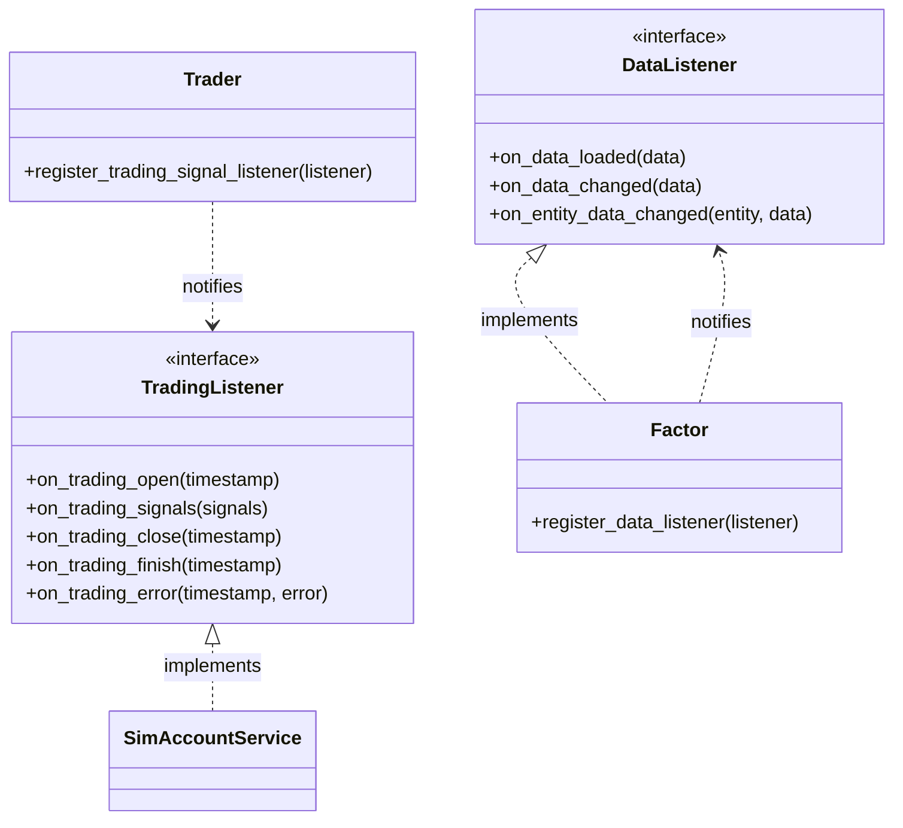

# ZVT Development Guide

Last updated: 2026-04-06
Source: [src/zvt/](../src/zvt/)

This guide covers design patterns, coding standards, and practical examples for extending ZVT with custom factors, recorders, and traders.

## Design Patterns

### Domain-Driven Design (DDD)

ZVT is organized around domain concepts rather than technical layers. Each market entity type (stock, index, fund) is a bounded context with its own:

- **Entity model** -- e.g., `Stock` in `src/zvt/domain/meta/stock_meta.py`
- **Data schemas** -- e.g., `Stock1dKdata` in `src/zvt/domain/quotes/stock/`
- **Recorders** -- e.g., `EMStockKdataRecorder` in `src/zvt/recorders/em/`
- **Factors** -- e.g., `TechnicalFactor` operating on stock kdata

The entity ID (`{entity_type}_{exchange}_{code}`) serves as the ubiquitous language linking all layers.

### Schema-First Data Modeling

All data is defined as SQLAlchemy declarative models before any code touches it:

```python
class Stock(StockMetaBase, TradableEntity):
    __tablename__ = "stock"
    float_cap = Column(Float)
    total_cap = Column(Float)
    controlling_holder = Column(String)
```

This provides:
- Automatic table creation and migration
- Type-safe queries via SQLAlchemy ORM
- Self-documenting data structures
- Provider-independent data definitions

### Registry Pattern

ZVT uses metaclass-based auto-registration for recorders and factors:

```mermaid
graph LR
    subgraph "At Class Definition Time"
        RC[Recorder class defined] -->|Meta.__new__| REG1[Register provider + data_schema<br/>in zvt_context]
        FC[Factor class defined] -->|FactorMeta.__new__| REG2[Register in<br/>factor_cls_registry]
        EC[Entity class defined] -->|@register_entity| REG3[Register entity type<br/>in zvt_context]
    end

    subgraph "At Runtime"
        CALL[Schema.record_data] -->|Lookup| REG1
        TRADER[Trader.init_factors] -->|Instantiate| REG2
        API[get_entities] -->|Lookup| REG3
    end
```

### Observer / Listener Pattern

The trading system uses the observer pattern extensively:



`Factor` implements `DataListener` and registers itself to recompute when data changes. `Trader` dispatches `TradingSignal` objects to all registered `TradingListener` instances (primarily `SimAccountService`).

### Pipeline Pattern (Transform/Accumulate)

The factor computation pipeline is a clean two-stage design:

1. **Transform** -- stateless, maps input columns to output columns
2. **Accumulate** -- stateful, incrementally builds results from new input + previous results

This separation means:
- Transformers are easy to test in isolation
- Accumulators maintain minimal state for incremental computation
- The same transformer can be reused across different accumulators

## Coding Standards

### File Organization

Each package follows a consistent structure:

```
package/
  __init__.py      # Aggregates __all__ from submodules
  submodule.py     # Implementation
```

The `__init__.py` pattern used throughout:

```python
# common code of the package
__all__ = []

# import all from submodule
from .submodule import *
from .submodule import __all__ as _submodule_all
__all__ += _submodule_all
```

### Naming Conventions

| Element | Convention | Example |
|---------|-----------|---------|
| Entity class | PascalCase | `Stock`, `Stockhk`, `Stockus` |
| Schema table | snake_case | `stock_1d_hfq_kdata` |
| Factor class | PascalCase, ends with `Factor` | `MacdFactor`, `BullFactor` |
| Recorder class | PascalCase, prefixed with provider | `EMStockKdataRecorder` |
| Trader class | PascalCase, ends with `Trader` | `StockTrader` |
| db_name | snake_case | `stock_meta`, `stock_1d_hfq_kdata` |
| entity_id | `{type}_{exchange}_{code}` | `stock_sh_000001` |

### Configuration Management

Use the layered config system:

```python
from zvt import zvt_config

# Read config values
data_provider = zvt_config.get("data_provider", "em")

# Override at init time
from zvt import init_env
init_env(zvt_home="/custom/path", data_provider="joinquant")
```

### Error Handling

The trader module defines specific exceptions in `src/zvt/trader/errors.py`:

- `NotEnoughMoneyError` -- insufficient cash for order
- `InvalidOrderError` -- order validation failure
- `NotEnoughPositionError` -- trying to sell more than available
- `InvalidOrderParamError` -- bad order parameters
- `WrongKdataError` -- missing or corrupt price data

Follow this pattern: define domain-specific exceptions rather than raising generic `Exception`.

## Creating a Custom Factor

### Step 1: Define the Factor Schema (optional, for persistence)

```python
# my_factors/schemas.py
from sqlalchemy import Column, Float
from sqlalchemy.orm import declarative_base
from zvt.contract.register import register_schema
from zvt.contract.schema import Mixin

MyFactorBase = declarative_base()

class MyRSIResult(MyFactorBase, Mixin):
    __tablename__ = "my_rsi_result"
    rsi = Column(Float)
    filter_result = Column(Float)  # True/False for selection

register_schema(db_name="my_rsi_result", schema_base=MyFactorBase)
```

### Step 2: Create the Transformer

```python
# my_factors/rsi_transformer.py
import pandas as pd
from zvt.contract.factor import Transformer

class RSITransformer(Transformer):
    def __init__(self, window=14):
        super().__init__()
        self.window = window
        self.indicators = ["rsi"]

    def transform_one(self, entity_id: str, df: pd.DataFrame) -> pd.DataFrame:
        delta = df["close"].diff()
        gain = delta.where(delta > 0, 0.0)
        loss = -delta.where(delta < 0, 0.0)

        avg_gain = gain.rolling(window=self.window).mean()
        avg_loss = loss.rolling(window=self.window).mean()

        rs = avg_gain / avg_loss
        df["rsi"] = 100 - (100 / (1 + rs))
        return df
```

### Step 3: Create the Factor Class

```python
# my_factors/rsi_factor.py
from zvt.factors.technical_factor import TechnicalFactor
from zvt.contract.factor import FactorMeta
from my_factors.rsi_transformer import RSITransformer
from my_factors.schemas import MyRSIResult

class RSIFactor(TechnicalFactor, metaclass=FactorMeta):
    transformer = RSITransformer(window=14)
    factor_schema = MyRSIResult

    def compute_result(self):
        super().compute_result()
        # RSI < 30 = oversold = buy signal
        self.result_df = (self.factor_df["rsi"] < 30).to_frame(name="filter_result")
```

### Step 4: Use the Factor

```python
factor = RSIFactor(
    codes=["000001", "000002"],
    start_timestamp="2024-01-01",
    end_timestamp="2024-12-31",
    need_persist=True,
)

# Get buy targets for a specific date
targets = factor.get_targets(timestamp="2024-06-15")

# Visualize
factor.draw(show=True)
```

## Creating a Custom Trader

### Step 1: Subclass StockTrader

```python
from zvt.trader.trader import StockTrader
from zvt.contract.factor import Factor
from my_factors.rsi_factor import RSIFactor

class RSITrader(StockTrader):
    def init_factors(self, entity_ids, entity_schema, exchanges, codes,
                     start_timestamp, end_timestamp, adjust_type=None):
        return [
            RSIFactor(
                entity_schema=entity_schema,
                codes=codes,
                start_timestamp=start_timestamp,
                end_timestamp=end_timestamp,
                adjust_type=adjust_type,
            )
        ]

    def on_factor_targets_filtered(self, timestamp, level, factor, long_targets, short_targets):
        # Limit to top 5 positions
        if len(long_targets) > 5:
            long_targets = long_targets[:5]
        return long_targets, short_targets

    def long_position_control(self):
        # Always allocate 20% per position
        return 0.2
```

### Step 2: Run the Backtest

```python
trader = RSITrader(
    codes=["000001", "000002", "600036"],
    start_timestamp="2024-01-01",
    end_timestamp="2024-12-31",
    provider="em",
    draw_result=True,
)
trader.run()
```

## Creating a Custom Recorder

### Step 1: Define the Schema

```python
from sqlalchemy import Column, Float, String
from sqlalchemy.orm import declarative_base
from zvt.contract.register import register_schema
from zvt.contract.schema import Mixin

MyDataBase = declarative_base()

class StockSentiment(MyDataBase, Mixin):
    __tablename__ = "stock_sentiment"
    code = Column(String(length=64))
    name = Column(String(length=128))
    sentiment_score = Column(Float)
    mention_count = Column(Float)

register_schema(db_name="stock_sentiment", schema_base=MyDataBase, entity_type="stock")
```

### Step 2: Implement the Recorder

```python
from zvt.contract.recorder import TimeSeriesDataRecorder
from zvt.domain.meta.stock_meta import Stock

class SentimentRecorder(TimeSeriesDataRecorder):
    provider = "my_sentiment"
    entity_provider = "em"
    entity_schema = Stock
    data_schema = StockSentiment

    def record(self, entity, start, end, size, timestamps):
        # Fetch from your data source
        url = f"https://api.example.com/sentiment/{entity.code}"
        resp = self.http_session.get(url, params={"start": start, "end": end})
        return resp.json()

    def get_data_map(self):
        return {
            "score": ("sentiment_score", float),
            "mentions": ("mention_count", int),
        }
```

### Step 3: Record Data

```python
StockSentiment.record_data(provider="my_sentiment", code="000001")
```

## Testing Strategy

### Test Environment

Set `TESTING_ZVT=1` to use the test home directory (`~/zvt-test-home`) with sample data:

```bash
TESTING_ZVT=1 pytest tests/
```

The test environment automatically unpacks sample data from `src/zvt/samples/data.zip`.

### Testing Factors

```python
def test_macd_factor():
    from zvt.factors.macd import BullFactor

    factor = BullFactor(
        codes=["000001"],
        start_timestamp="2023-01-01",
        end_timestamp="2023-06-30",
    )

    assert factor.factor_df is not None
    assert "diff" in factor.factor_df.columns
    assert "dea" in factor.factor_df.columns
    assert "macd" in factor.factor_df.columns
    assert factor.result_df is not None
    assert "filter_result" in factor.result_df.columns
```

### Testing Data Correctness

Use the built-in `test_data_correctness()` class method:

```python
Stock1dKdata.test_data_correctness(
    provider="em",
    data_samples=[
        {
            "id": "stock_sh_000001_2024-01-02",
            "timestamp": "2024-01-02",
            "open": 9.50,
            "close": 9.45,
        }
    ],
)
```

## Project Structure Best Practices

### Adding a New Entity Type

1. Create `src/zvt/domain/meta/<entity>_meta.py` with entity class and `register_schema()`
2. Create `src/zvt/domain/quotes/<entity>/` with kdata schemas for each interval level
3. Add recorder(s) in `src/zvt/recorders/<provider>/`
4. Update `src/zvt/domain/__init__.py` to import the new submodule

### Adding a New Data Provider

1. Create `src/zvt/recorders/<provider>/` directory
2. Implement recorder classes inheriting from `TimeSeriesDataRecorder` or `FixedCycleDataRecorder`
3. Set `provider = "{provider}"` and `data_schema` on each recorder class
4. The metaclass handles registration automatically

### Adding a New Factor Type

1. Create factor class inheriting from `TechnicalFactor` or `Factor`
2. Implement a `Transformer` and/or `Accumulator`
3. Optionally define a `factor_schema` for persistence
4. Use `metaclass=FactorMeta` for auto-registration
5. Add to `src/zvt/factors/__init__.py` for discoverability

```mermaid
graph TD
    subgraph "Extension Points"
        A[New Entity Type] --> A1[domain/meta/]
        A --> A2[domain/quotes/]
        A --> A3[recorders/]

        B[New Provider] --> B1[recorders/{provider}/]
        B --> B2[Set provider + data_schema]

        C[New Factor] --> C1[factors/]
        C --> C2[Transformer or Accumulator]
        C --> C3[Optional factor_schema]

        D[New Trader] --> D1[Subclass Trader/StockTrader]
        D --> D2[Override init_factors]
        D --> D3[Override position control]
    end
```

## Debugging Tips

### Inspecting Registered Schemas

```python
from zvt.contract import zvt_context

# All registered entity types
print(zvt_context.tradable_entity_types)

# All schemas for a db_name
print(zvt_context.dbname_map_schemas.get("stock_meta"))

# Providers for a schema
from zvt.domain import Stock1dKdata
print(Stock1dKdata.get_providers())

# Recorder class for a provider
print(Stock1dKdata.provider_map_recorder)
```

### Inspecting Factor State

```python
from zvt.contract.zvt_info import FactorState

# Query all factor states
states = FactorState.query_data(provider="zvt", return_type="df")
print(states)
```

### Viewing Storage Layout

```python
from zvt import zvt_env
import os

data_path = zvt_env["data_path"]
for provider_dir in os.listdir(data_path):
    full_path = os.path.join(data_path, provider_dir)
    if os.path.isdir(full_path):
        dbs = [f for f in os.listdir(full_path) if f.endswith(".db")]
        print(f"{provider_dir}: {len(dbs)} databases")
```

## Source References

- Contract layer: [src/zvt/contract/](../src/zvt/contract/)
- Factor implementations: [src/zvt/factors/](../src/zvt/factors/)
- Recorder implementations: [src/zvt/recorders/](../src/zvt/recorders/)
- Trader engine: [src/zvt/trader/](../src/zvt/trader/)
- Domain model: [src/zvt/domain/](../src/zvt/domain/)
- Test directory: [tests/](../tests/)
- Sample data: [src/zvt/samples/](../src/zvt/samples/)

## Configuration Reference

ZVT uses a layered JSON configuration system. The default config ships at `src/zvt/config.json` and is copied to `~/zvt-home/config.json` on first run. Override values by editing the file or passing kwargs to `init_env()`.

| Parameter | Type | Default | Description |
|-----------|------|---------|-------------|
| `jq_username` | `str` | `""` | JoinQuant account username (required for `joinquant` provider) |
| `jq_password` | `str` | `""` | JoinQuant account password |
| `http_proxy` | `str` | `"127.0.0.1:1087"` | HTTP proxy address for outbound requests |
| `https_proxy` | `str` | `"127.0.0.1:1087"` | HTTPS proxy address |
| `smtp_host` | `str` | `"smtpdm.aliyun.com"` | SMTP server for email notifications (informer) |
| `smtp_port` | `str` | `"80"` | SMTP port |
| `email_username` | `str` | `""` | Email sender address |
| `email_password` | `str` | `""` | Email sender password |
| `wechat_app_id` | `str` | `""` | WeChat Official Account app ID (for WeChat notifications) |
| `wechat_app_secrect` | `str` | `""` | WeChat app secret |
| `qiye_wechat_bot_token` | `str` | `""` | Enterprise WeChat bot webhook token |
| `qmt_mini_data_path` | `str` | `"D:\\qmt\\userdata_mini"` | Path to QMT mini client data directory (Windows only) |
| `qmt_account_id` | `str` | `""` | QMT trading account ID |
| `moonshot_api_key` | `str` | `""` | Moonshot AI API key (for AI tag suggestions) |
| `qwen_api_key` | `str` | `""` | Qwen AI API key (for AI tag suggestions) |
| `em_header` | `str` | `""` | Custom HTTP header for Eastmoney requests (set to browser User-Agent to avoid rate limits) |
| `storage.base_path` | `str\|null` | `null` | Override default data storage base path |
| `storage.path_template` | `str\|null` | `null` | Custom path template for database files |
| `storage.storage_routes` | `dict` | `{}` | Per-schema storage route overrides (see `storage_config.md`) |
| `storage.schema_providers` | `dict` | `{...}` | Maps db_name to list of providers |

**Environment variables:**

| Variable | Default | Description |
|----------|---------|-------------|
| `ZVT_HOME` | `~/zvt-home` | Root directory for all ZVT data, logs, and config |
| `TESTING_ZVT` | unset | Set to `1` to use `~/zvt-test-home` with sample data |
| `SQLALCHEMY_WARN_20` | `1` | SQLAlchemy 2.0 deprecation warnings (set by ZVT at import) |

## Troubleshooting

### 1. `ModuleNotFoundError: No module named 'zvt'`

ZVT uses a `src/` layout. Install in development mode:
```bash
pip install -e .
```

### 2. Eastmoney recorder returns empty data or HTTP 403

Eastmoney may throttle requests without a valid browser header. Set `em_header` in `~/zvt-home/config.json` to your browser's `User-Agent` string, or add a delay between batch requests.

### 3. JoinQuant authentication fails

- Verify your credentials at [joinquant.com](https://www.joinquant.com/) first.
- Ensure `jq_username` and `jq_password` are set in `~/zvt-home/config.json` (not the package-level `src/zvt/config.json`).
- JoinQuant has daily API call limits on free accounts. Check your remaining quota.

### 4. SQLite `database is locked` error

This occurs when multiple processes write to the same database. ZVT uses WAL mode for hot tables, but concurrent recorder processes can still conflict. Run only one recorder per (provider, schema) pair at a time, or configure separate `storage_routes` for different processes.

### 5. `WrongKdataError` during factor computation

The factor requires kdata that has not been recorded yet. Record data first:
```python
Stock1dKdata.record_data(provider="em", code="000001")
```

### 6. QMT recorder fails with `ImportError`

QMT is Windows-only and requires the QMT mini client to be installed and running. On Linux/macOS the QMT module is intentionally skipped. Ensure `qmt_mini_data_path` points to the correct directory.

### 7. Proxy connection errors

The default proxy is `127.0.0.1:1087`. If you do not use a proxy, set both `http_proxy` and `https_proxy` to `""` in your config:
```python
init_env(zvt_home="~/zvt-home", http_proxy="", https_proxy="")
```

### 8. Pandas `SettingWithCopyWarning` raised as error

ZVT sets `pd.set_option("mode.chained_assignment", "raise")` at import time. If your custom code triggers this, create an explicit copy of the DataFrame before modifying it:
```python
df = original_df.copy()
df["new_col"] = ...
```

### 9. Factor `result_df` is empty

Check that: (a) data exists for the requested date range, (b) the `provider` argument matches how data was recorded, and (c) the entity codes are valid (format: `000001`, not `stock_sh_000001`).

### 10. Storage grows too large

Each (provider, db_name) pair creates a separate SQLite file. To reclaim space, delete databases you no longer need from `~/zvt-home/data/<provider>/`. Use `zvt_env["data_path"]` to locate the directory programmatically.

## Security Considerations

- **Credential storage**: JoinQuant credentials, email passwords, WeChat secrets, and AI API keys are stored in **plaintext** in `~/zvt-home/config.json`. Restrict file permissions (`chmod 600`) and never commit this file to version control.
- **Proxy exposure**: The default proxy setting (`127.0.0.1:1087`) assumes a local SOCKS/HTTP proxy. Ensure your proxy does not leak credentials or route traffic through untrusted networks.
- **QMT account security**: The QMT account ID grants access to a real brokerage account. Protect `config.json` and the QMT data directory from unauthorized access.
- **SQL injection**: ZVT uses SQLAlchemy ORM for all database access, which parameterizes queries. However, custom SQL strings passed to `pd.read_sql` should still be parameterized.
- **Network requests**: Recorders fetch data over HTTP/HTTPS from Eastmoney, JoinQuant, Sina, and exchange sites. Verify that HTTPS is used where available and that proxy configurations do not downgrade connections.
- **Sample data in tests**: The `TESTING_ZVT=1` mode unpacks `src/zvt/samples/data.zip` to `~/zvt-test-home/data/`. Ensure test environments do not accidentally connect to production data or real brokerage accounts.
- **AI API keys**: Moonshot and Qwen API keys are used for the tagging system. Rotate keys regularly and use environment-specific keys rather than sharing across environments.

---
## See Also
- [README](README.md) — Project overview and quick start
- [Architecture](architecture.md) — System design and components
- [Workflow](workflow.md) — Event flows and processing pipelines
- [State Management](state-management.md) — State lifecycle and data models
