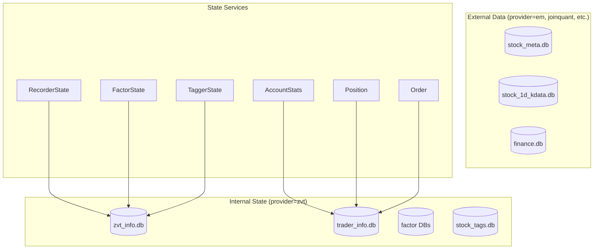
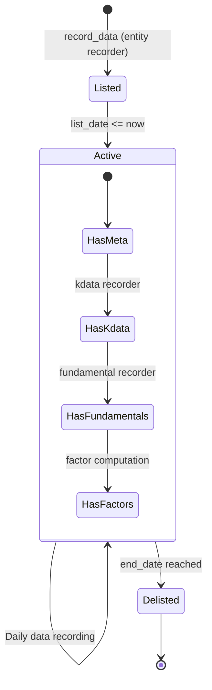
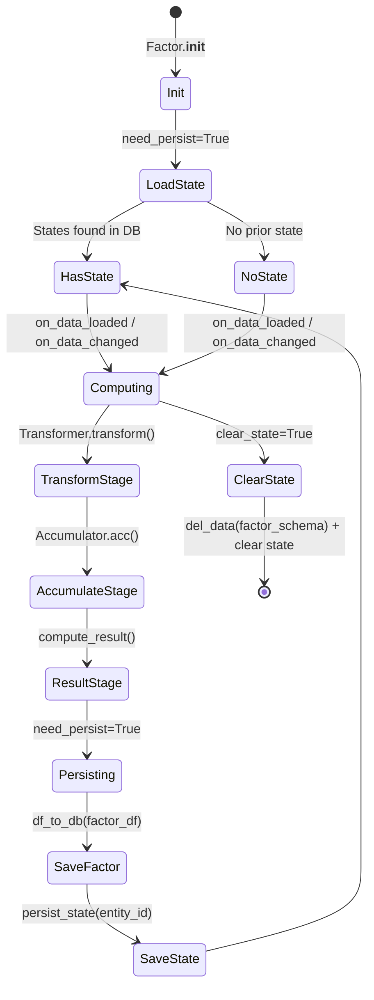
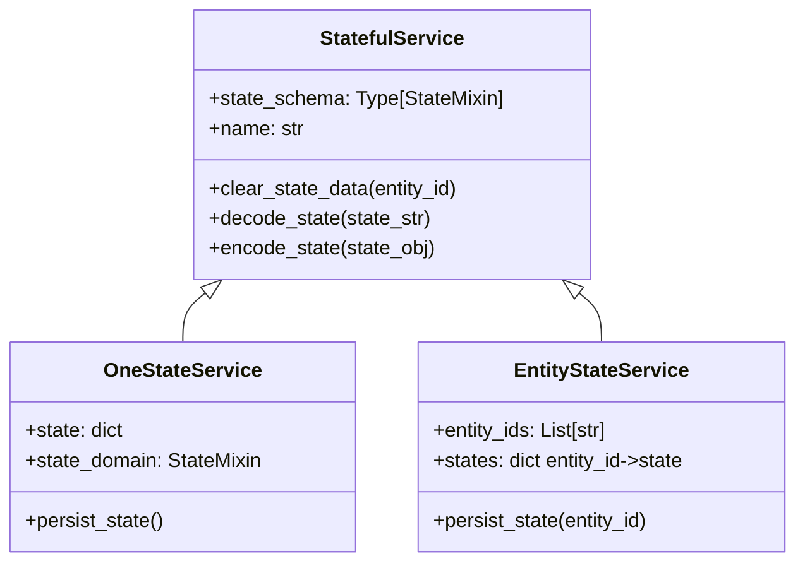
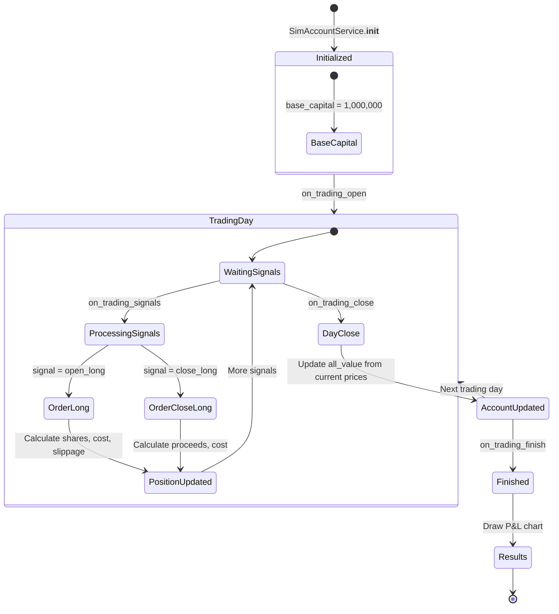

# ZVT State Management

Last updated: 2026-04-06
Source: [src/zvt/](../src/zvt/)

ZVT manages state at multiple levels: entity metadata, market data schemas, factor computation state, recorder state, and trader account state. This document covers how each type of state is defined, persisted, and updated.

## State Architecture Overview



## Entity State

### Entity Registration

Entities are registered at import time via the `@register_entity` decorator. The registration populates `zvt_context`:

```python
@register_entity(entity_type="stock")
class Stock(StockMetaBase, TradableEntity):
    __tablename__ = "stock"
    float_cap = Column(Float)
    total_cap = Column(Float)
    # ...
```

This adds `"stock"` to `zvt_context.tradable_entity_types` and maps it to the `Stock` class in `zvt_context.tradable_schema_map`.

### Entity ID Convention

All entity IDs follow the format: `{entity_type}_{exchange}_{code}`

Examples:
- `stock_sh_000001` -- Ping An Bank on Shanghai Exchange
- `index_sh_000300` -- CSI 300 Index
- `future_shfe_RB2401` -- Rebar futures

This convention is enforced by `decode_entity_id()` in `src/zvt/contract/api.py` which splits the ID into its three components.

### Entity Lifecycle



Entity metadata (name, list_date, end_date, exchange) is recorded once by the entity recorder, then referenced by all downstream data recorders.

## Data Schema State

### Schema Registration

Every data schema is registered via `register_schema()` which links a `db_name` to a SQLAlchemy declarative base:

```python
register_schema(
    db_name="stock_meta",
    schema_base=StockMetaBase,
)
```

This populates:
- `zvt_context.dbname_map_base["stock_meta"] = StockMetaBase`
- `zvt_context.dbname_map_schemas["stock_meta"] = [Stock, StockDetail]`
- Each schema class gets `_zvt_db_name = "stock_meta"` and `_zvt_internal = False`

### Provider-Schema Binding

Providers are bound to schemas through the Recorder metaclass. When a recorder class is defined with `provider` and `data_schema`, the metaclass calls:

```python
cls.data_schema.register_recorder_cls(cls.provider, cls)
```

This builds `data_schema.provider_map_recorder`, which `Mixin.record_data()` uses to find the right recorder class at runtime.

### Kdata Schema Naming Convention

Kdata tables follow a structured naming pattern:

```
{entity_type}_{level}_{adjust_type}_kdata
```

Examples:
- `stock_1d_hfq_kdata` -- Stock daily, post-adjusted
- `stock_5m_qfq_kdata` -- Stock 5-minute, pre-adjusted
- `stock_1d_bfq_kdata` -- Stock daily, unadjusted

The `FixedCycleDataRecorder` parses the table name to extract `level` and `adjust_type` automatically.

### Table Migration

On first access via `get_db_engine()`, ZVT performs automatic schema migration:

1. Creates tables that do not exist (`schema_base.metadata.create_all()`)
2. Adds missing columns to existing tables (`ALTER TABLE ... ADD COLUMN`)
3. Creates standard indexes on `timestamp`, `entity_id`, `code`, and composite indexes
4. Sets `PRAGMA journal_mode` (WAL for hot tables like `zvt_info`, `stock_quote`)

Source: [src/zvt/contract/register.py](../src/zvt/contract/register.py) `ensure_schema_tables_and_indexes()`

## Factor State

### StateMixin and State Schemas

Factor state is managed through the `StateMixin` base:

```python
class StateMixin(Mixin):
    state_name = Column(String(length=128))  # unique service name
    state = Column(Text())                    # JSON-serialized state
```

Three concrete state schemas exist in `src/zvt/contract/zvt_info.py`:

| Schema | Table | Used By |
|--------|-------|---------|
| `RecorderState` | `recorder_state` | `Recorder` subclasses via `OneStateService` |
| `FactorState` | `factor_state` | `Factor` subclasses via `EntityStateService` |
| `TaggerState` | `tagger_state` | Tag service components |

All three are stored in the `zvt_info` database (internal, provider="zvt").

### Factor State Lifecycle



### State Service Hierarchy



**`OneStateService`** stores a single state object for the entire service instance. Used by `Recorder` to track overall recorder progress. The state ID is the service name.

**`EntityStateService`** stores one state object per entity. Used by `Factor` to track per-entity computation state (e.g., which timestamp was last computed). The state ID is `{service_name}_{entity_id}`.

### State Encoding

States are serialized as JSON text. Custom serialization is supported through:
- `state_encoder()` -- returns a custom `json.JSONEncoder` class
- `state_object_hook()` -- returns a custom deserialization hook for `json.loads()`
- `factor_col_map_object_hook()` -- per-column custom deserialization for factor DataFrames

## Trader State

### Account State Model

The trading engine maintains three persistent schemas (stored in `trader_info` database):

| Schema | Table | Key Fields |
|--------|-------|------------|
| `TraderInfo` | `trader_info` | `trader_name`, config metadata |
| `AccountStats` | `account_stats` | `all_value`, `cash`, `positions`, `profit_rate` |
| `Position` | `position` | `entity_id`, `long_amount`, `available_long`, `profit_rate` |
| `Order` | `order` | `entity_id`, `order_type`, `order_price`, `order_amount` |

### Trading State Transitions



### Position Model

Each position tracks:

| Field | Description |
|-------|-------------|
| `entity_id` | The asset identifier |
| `long_amount` | Total shares held long |
| `available_long` | Shares available to sell (respects T+1) |
| `average_long_price` | Weighted average entry price |
| `cost` | Total cost basis |
| `market_value` | Current market value |
| `profit_rate` | Unrealized P&L percentage |

Position availability respects the `get_trading_t()` setting from `TradableEntity`. For A-shares, this is T+1 (shares bought today are available to sell tomorrow).

### Account Stats Snapshots

`AccountStats` is recorded at each `on_trading_close()` event, creating a time series of:
- `all_value` -- total portfolio value (cash + market value of all positions)
- `cash` -- available cash
- `position_count` -- number of active positions
- `closing_pnl` -- realized P&L from closed positions that day

This time series powers the equity curve chart drawn by `Trader.on_finish()`.

## Global Context State

The `zvt_context` singleton (`Registry` in `src/zvt/contract/context.py`) is the in-memory state of the entire framework. It is populated at import time and evolves as schemas and recorders are registered.

| Field | Type | Content |
|-------|------|---------|
| `providers` | `list[str]` | All registered provider names |
| `tradable_entity_types` | `list[str]` | Entity type strings |
| `tradable_entity_schemas` | `list[Type]` | Entity schema classes |
| `schemas` | `list[Type]` | All registered schema classes |
| `tradable_schema_map` | `dict` | entity_type -> schema class |
| `dbname_map_base` | `dict` | db_name -> declarative base |
| `dbname_map_schemas` | `dict` | db_name -> list of schemas |
| `provider_map_dbnames` | `dict` | provider -> list of db_names |
| `factor_cls_registry` | `dict` | factor class name -> class |
| `internal_db_names` | `set` | db_names marked as internal |
| `storage_backend` | `StorageBackend` | Optional injected storage backend |
| `route_registry` | `RouteRegistry` | Optional injected route registry |

## Source References

- State mixin and schemas: [src/zvt/contract/zvt_info.py](../src/zvt/contract/zvt_info.py)
- State services: [src/zvt/contract/base_service.py](../src/zvt/contract/base_service.py)
- Factor state management: [src/zvt/contract/factor.py](../src/zvt/contract/factor.py)
- Schema registration: [src/zvt/contract/register.py](../src/zvt/contract/register.py)
- Global context: [src/zvt/contract/context.py](../src/zvt/contract/context.py)
- Trader schemas: [src/zvt/trader/trader_schemas.py](../src/zvt/trader/trader_schemas.py)
- Sim account: [src/zvt/trader/sim_account.py](../src/zvt/trader/sim_account.py)
- Trader info API: [src/zvt/trader/trader_info_api.py](../src/zvt/trader/trader_info_api.py)

---
## See Also
- [README](README.md) — Project overview and quick start
- [Architecture](architecture.md) — System design and components
- [Workflow](workflow.md) — Event flows and processing pipelines
- [Development](development.md) — Development guide and best practices
