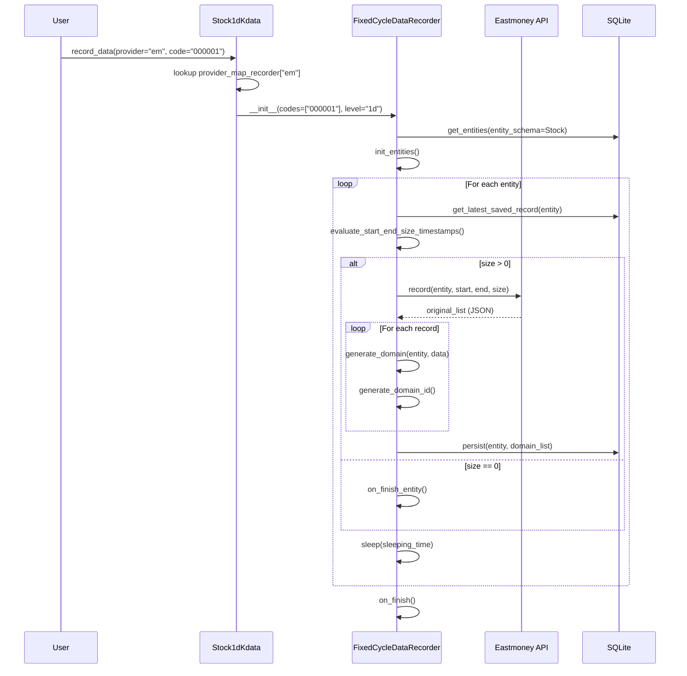
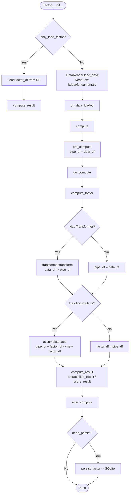
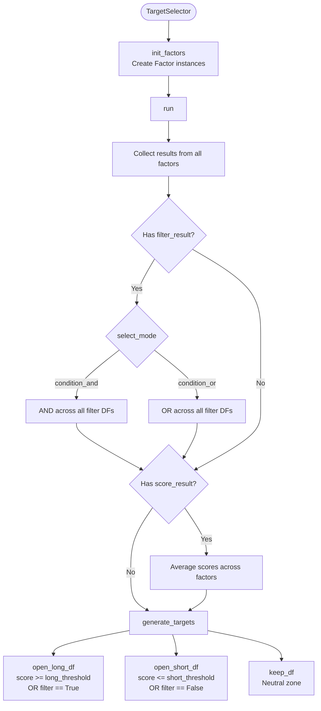
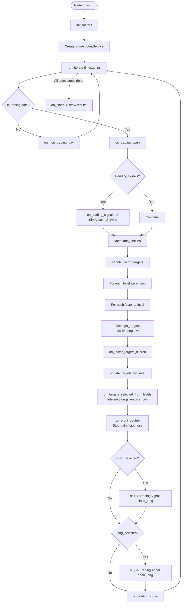

# ZVT Workflows

Last updated: 2026-04-06
Source: [src/zvt/](../src/zvt/)

This document describes the four primary workflows in ZVT: data recording, factor computation, stock selection, and trading.

## 1. Data Recording Flow

Data recording is the process of fetching market data from external providers and persisting it to local SQLite databases. The recorder hierarchy supports three patterns: entity-event recording, time-series recording, and fixed-cycle (kdata) recording.

### Recorder Class Hierarchy

| Class | Purpose | Example Use |
|-------|---------|-------------|
| `Recorder` | Base class; sets up provider, session, HTTP client | -- |
| `EntityEventRecorder` | Records data per entity; manages entity list initialization | Stock list, fund list |
| `TimeSeriesDataRecorder` | Adds incremental time-based fetching with dedup | Balance sheets, dividends |
| `FixedCycleDataRecorder` | Specialized for OHLCV kdata at specific intervals | `Stock1dKdata`, `Stock5mKdata` |
| `TimestampsDataRecorder` | Fetches at specific known timestamps | Report-period based data |

### Recording Sequence



### Key Implementation Details

**Incremental fetching**: `evaluate_start_end_size_timestamps()` finds the latest saved record for each entity and calculates how many new records to fetch. For `FixedCycleDataRecorder`, it uses `evaluate_size_from_timestamp()` which counts intervals between the last saved timestamp and now.

**Duplicate handling**: Two strategies via `fix_duplicate_way`:
- `"add"` -- append a UUID suffix to the duplicate ID
- `"ignore"` -- skip the duplicate record

**Unfinished kdata**: For kdata recorders, the last two records are checked. If both fall in the same interval, the older one is deleted (it was an incomplete bar from a previous run).

**Recorder registration**: The `Meta` metaclass on `Recorder` auto-registers each subclass with its `data_schema` when the class is defined. For kdata recorders with `supported_levels`, it pre-registers all concrete kdata schemas (e.g., `Stock1dKdata`, `Stock5mKdata`).

### Provider Map

| Provider | Module | Covers |
|----------|--------|--------|
| `em` | `src/zvt/recorders/em/` | Eastmoney -- stocks, kdata, fundamentals |
| `eastmoney` | `src/zvt/recorders/eastmoney/` | Legacy Eastmoney recorder |
| `joinquant` | `src/zvt/recorders/joinquant/` | JoinQuant -- kdata, fundamentals |
| `sina` | `src/zvt/recorders/sina/` | Sina Finance -- stock quotes |
| `exchange` | `src/zvt/recorders/exchange/` | Exchange direct feeds |
| `qmt` | `src/zvt/recorders/qmt/` | QMT broker (Windows only) |
| `jqka` | `src/zvt/recorders/jqka/` | 10jqka (Tonghuashun) |
| `wb` | `src/zvt/recorders/wb/` | Additional web-based source |

## 2. Factor Computation Flow

Factors transform raw market data into trading signals through a three-stage pipeline.



### Transformer vs Accumulator

**Transformer** (`transform(input_df) -> pd.DataFrame`):
- Stateless, pure function
- Operates on the full DataFrame grouped by `entity_id`
- Example: `MacdTransformer` computes MACD, signal, histogram from OHLCV
- Adds new columns (e.g., `diff`, `dea`, `macd`, `bull`, `live`, `live_count`)

**Accumulator** (`acc(input_df, acc_df, states) -> (pd.DataFrame, dict)`):
- Stateful, carries per-entity state between invocations
- Uses `acc_window` to control how much historical data to retain
- Returns updated DataFrame and updated state dict
- Used when computation depends on previously computed values (e.g., running totals, Zen theory strokes)

### Result Types

The `result_df` produced by `compute_result()` contains standardized columns:

| Column | Type | Meaning |
|--------|------|---------|
| `filter_result` | `bool` or `None` | `True` = positive signal, `False` = negative, `None` = neutral |
| `score_result` | `float` | Normalized score, typically in [-1, 1] or [0, 1] |

These are consumed by `TargetSelector` and `Trader` for stock selection and order generation.

### Built-in Factors

| Factor | Base | Description |
|--------|------|-------------|
| `MacdFactor` | `TechnicalFactor` | MACD with diff/dea/histogram |
| `BullFactor` | `MacdFactor` | Filter: True when MACD indicates bull |
| `KeepBullFactor` | `BullFactor` | Filter: True when bull sustained for N bars |
| `GoldCrossFactor` | `MacdFactor` | Filter: True on MACD golden cross |
| `LiveOrDeadFactor` | `MacdFactor` | Filter: Detects transitions from dead cross to golden cross |

Source: [src/zvt/factors/macd/macd_factor.py](../src/zvt/factors/macd/macd_factor.py)

## 3. Stock Selection Flow

Stock selection combines multiple factor results to generate final buy/sell target lists.



### Selection Modes

- **`condition_and`** -- an entity must pass ALL factor filters to be selected (intersection)
- **`condition_or`** -- an entity passes if ANY factor filter selects it (union)

When both filter and score results exist, the filter is applied first to narrow candidates, then scores determine the final ranking within the filtered set.

### Usage Pattern

```python
from zvt.factors.target_selector import TargetSelector

class MySelector(TargetSelector):
    def init_factors(self, entity_ids, entity_schema, exchanges, codes,
                     start_timestamp, end_timestamp, level):
        bull = BullFactor(codes=codes, start_timestamp=start_timestamp,
                          end_timestamp=end_timestamp, level=level)
        self.add_factor(bull)

selector = MySelector(codes=["000001", "000002"],
                       start_timestamp="2024-01-01",
                       end_timestamp="2024-12-31")
selector.run()
targets = selector.get_open_long_targets(timestamp="2024-06-15")
```

## 4. Trading Flow

The trading flow ties factor computation and stock selection into an event-driven backtesting loop.



### Order Execution Model

When `buy()` or `sell()` is called, the Trader creates `TradingSignal` objects with:
- `entity_id` -- which asset
- `trading_signal_type` -- `open_long`, `close_long`, `open_short`, `close_short`
- `position_pct` -- fraction of portfolio to allocate
- `due_timestamp` -- when the order should execute (next bar)

These signals are dispatched to `SimAccountService` via `on_trading_signals()`. The sim account:
1. Looks up the current kdata price for the entity at `due_timestamp`
2. Calculates order size based on `position_pct` and current account value
3. Applies slippage and commission costs
4. Updates `Position` and `AccountStats` records in the `trader_info` SQLite database

### Position Control

The `Trader` base class provides default position sizing:
- No positions: allocate 20% per new position
- Under 10 positions: allocate 50% per new position
- Otherwise: allocate 100% / N per position

Stop-gain and stop-loss thresholds default to `(3.0, -0.3)` -- i.e., take profit at +300%, cut loss at -30%.

### Multi-Level Trading

ZVT supports trading with factors at multiple time levels (e.g., daily + weekly). The algorithm:
1. Each level computes its own long/short targets
2. Long targets are **intersected** across levels (must appear in all)
3. Short targets are **unioned** across levels (appear in any)
4. The trader's main loop runs at the minimum level

This allows filtering with a higher timeframe trend while timing entries on a lower timeframe.

## Source References

- Recorder base: [src/zvt/contract/recorder.py](../src/zvt/contract/recorder.py)
- Factor base: [src/zvt/contract/factor.py](../src/zvt/contract/factor.py)
- Target selector: [src/zvt/factors/target_selector.py](../src/zvt/factors/target_selector.py)
- Trader engine: [src/zvt/trader/trader.py](../src/zvt/trader/trader.py)
- Sim account: [src/zvt/trader/sim_account.py](../src/zvt/trader/sim_account.py)
- Technical factor: [src/zvt/factors/technical_factor.py](../src/zvt/factors/technical_factor.py)
- MACD factor: [src/zvt/factors/macd/macd_factor.py](../src/zvt/factors/macd/macd_factor.py)
- Data reader: [src/zvt/contract/reader.py](../src/zvt/contract/reader.py)
- Kdata API: [src/zvt/api/kdata.py](../src/zvt/api/kdata.py)

---
## See Also
- [README](README.md) — Project overview and quick start
- [Architecture](architecture.md) — System design and components
- [State Management](state-management.md) — State lifecycle and data models
- [Development](development.md) — Development guide and best practices
